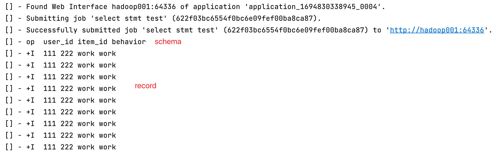

# flink platform tools 
一些 Flink 任务提交平台的工具代码

## flinksql-udf-searcher
* 用于解析 jar 包中符合 FlinkSQL UDF 的类全路径
```java
// 自定义的 flinksql udf jar 包
String jarFilePath = "myudf.jar";
// 返回 flinksql udf 实现类的全类名列表
List<String> udfClassList = UdfClassSearcher.getUdfClassList(jarFilePath);
```

## flinksql-query
* 根据 sql-client 改造而来，提供传入 select 语句查询 flink 相关表数据的功能
* 支持设置最大查询时间，最大返回条数
* 先下载源码打包，然后按下面脚本说明启动
```shell
#!/bin/bash

# 需要 flink-shaded-hadoop-3-uber-3.1.1.7.2.9.0-173-9.0.jar
FLINK_LIB_DIR=/Users/gaosh/apps/flink-1.14.4/lib
# 需要 hadoop 的配置文件
HADOOP_CONF_DIR=/Users/gaosh/apps/hadoop/etc/hadoop

FLINK_CLASSPATH=`pwd`/flinksql-query.jar
for i in $(ls ${FLINK_LIB_DIR}/*.jar)
do
FLINK_CLASSPATH="${FLINK_CLASSPATH}:${i}"
done

export FLINK_CONF_DIR=/Users/gaosh/apps/flink-1.14.4/conf

# 三个参数分别是 
# 1. yarn-session 的 application id
# 2. 初始化 catalog 的 sql 脚本文件
# 3. 查询 sql
${JAVA_HOME}/bin/java -classpath ${HADOOP_CONF_DIR}:${FLINK_CLASSPATH} com.gaosh96.flink.SqlClientApp application_1690619119967_0002 /Users/gaosh/init_sql.sql 'select * from catalog.databse.table'
```
* 效果如下图
  